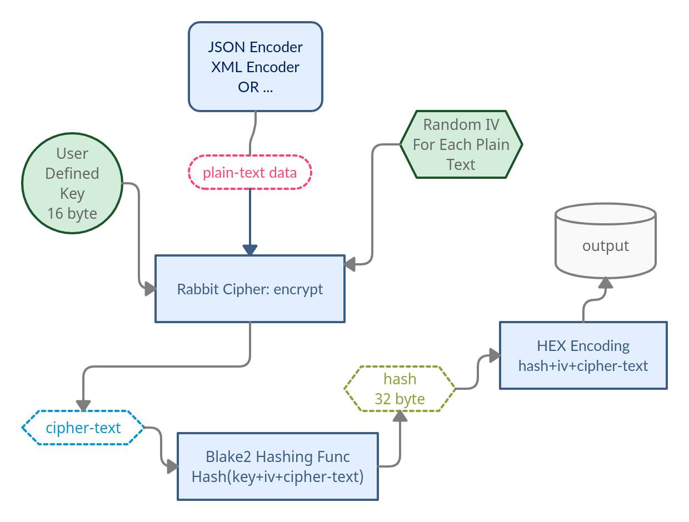
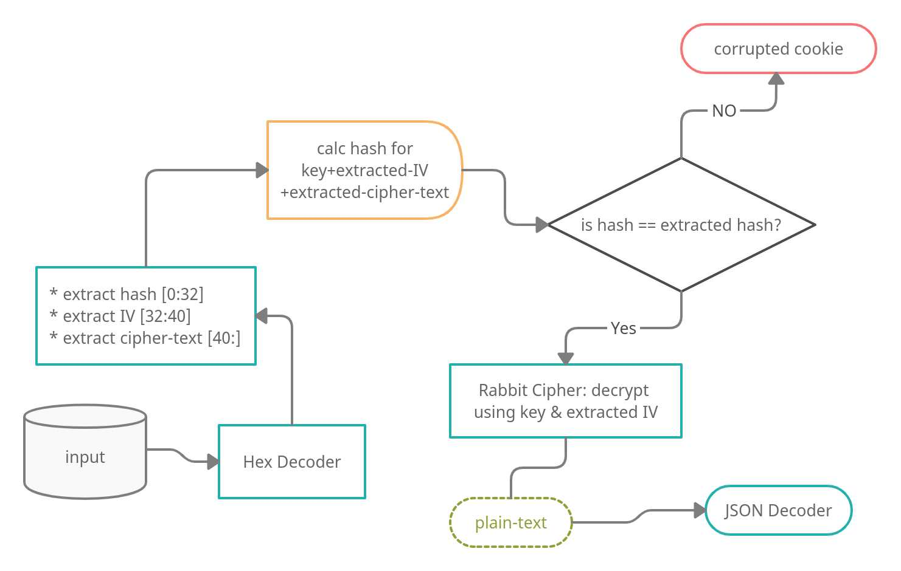

# ecookie
sign, encrypt and authenticate cookies with golang...   
this package uses rabbit cipher to encrypt and blake2 hash function in order to authenticate cookies.

why ecookies are special? 
- client cannot read content of the cookie
- client cannot change or modify content of the cookie.

### usage and example
checkout [example](example/) folder... simple http server that uses ecookie package 
this package lives on [snix public git servers](https://git.snix.ir/), this one is just a mirror..  
use `go get snix.ir/ecookie` or `go get github.com/sina-ghaderi/ecookie` to use this packge.

### ecookie process flow
ecookie package process flow, this is how ecookie encrypt data and calculate MAC  

  
ecookie decrypting data and cookie auth 

  
